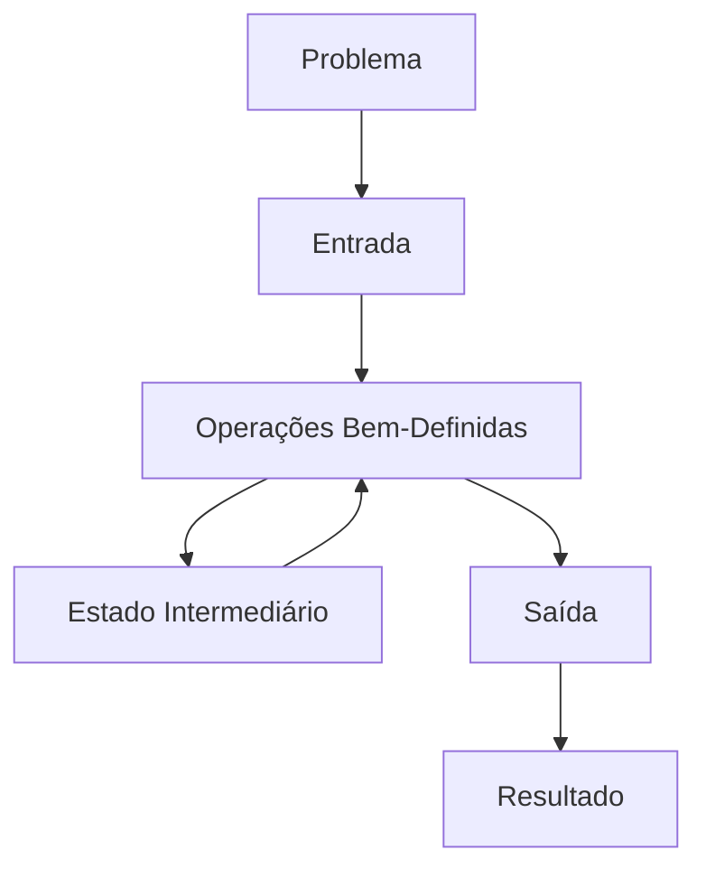

# 📊 Introdução a Algoritmos

> Um algoritmo é uma sequência finita de operações bem-definidas para resolver um problema.

---

## 📖 Definição

Um **algoritmo** é:
- **Finito:** Tem um fim definido
- **Determinístico:** Mesma entrada → mesma saída
- **Eficaz:** Resolvem o problema corretamente
- **Geral:** Funciona para inputs variados

---

## 🧠 Componentes Essenciais



### 1. **Entrada (Input)**
- Dados que alimentam o algoritmo
- Pode ser vazio

### 2. **Processamento**
- Sequência de operações
- Passos claros e determinísticos

### 3. **Saída (Output)**
- Resultado do processamento
- Deve ser correto

---

## 💻 Exemplo Simples: Busca Linear

### Pseudocódigo
```
BUSCAR_LINEAR(array, alvo)
    para cada elemento em array:
        se elemento == alvo:
            retorna índice
    retorna -1 (não encontrado)
```

### Python
```python
def busca_linear(array, alvo):
    for i, elemento in enumerate(array):
        if elemento == alvo:
            return i
    return -1

# Uso
numeros = [5, 2, 8, 1, 9]
print(busca_linear(numeros, 8))  # Output: 2
```

### Funcionamento
```
Array: [5, 2, 8, 1, 9]
Alvo: 8

Passo 1: Verifica 5 != 8
Passo 2: Verifica 2 != 8
Passo 3: Verifica 8 == 8 ✓ ENCONTRADO
Retorna índice 2
```

---

## ⏱️ Complexidade

Busca Linear:
- **Melhor caso:** O(1) - elemento no primeiro índice
- **Pior caso:** O(n) - elemento no final ou não existe
- **Caso médio:** O(n/2) ≈ O(n)
- **Espaço:** O(1) - sem espaço extra

---

## 🏛️ Paradigmas de Algoritmos

```
┌─────────────────────────────────┐
│      Paradigmas de Algoritmos    │
├─────────────────────────────────┤
│ 1. Força Bruta                  │ Tenta todas soluções
│ 2. Dividir e Conquistar         │ Divide o problema
│ 3. Guloso (Greedy)              │ Escolha ótima local
│ 4. Programação Dinâmica         │ Memoriza soluções
│ 5. Backtracking                 │ Tenta e volta atrás
│ 6. Busca em Largura/Profundidade │ Explora grafo
│ 7. Branch & Bound               │ Poda de soluções ruins
└─────────────────────────────────┘
```

---

## 📚 Categorias de Algoritmos

### **Por Tipo de Problema**
- Busca
- Ordenação
- Grafos
- Dinâmica
- Teoria dos Números
- Geometria Computacional
- String Matching

### **Por Técnica**
- Iterativos
- Recursivos
- Matemáticos
- Probabilísticos
- Aproximação

---

## 🎯 Propriedades Desejáveis

✅ **Corretude** - Solução correta  
✅ **Eficiência** - Usa menos tempo/espaço  
✅ **Clareza** - Fácil de entender  
✅ **Generalidade** - Funciona para vários inputs  
✅ **Robustez** - Trata erros graciosamente  

---

## 💡 Casos Reais

### Busca no Google
- Índices invertidos (estrutura)
- [[cs-search-algorithms|Busca binária]] em bilhões de documentos
- PageRank (algoritmo de grafo)

### Netflix Recomendações
- [[cs-dynamic-programming|Programação dinâmica]]
- Similaridade (algoritmo matemático)
- Aprendizado de máquina

### Maps (Roteamento)
- [[cs-graph-algorithms|Dijkstra]] para rota mais curta
- A* para otimização
- Atualização em tempo real

---

## ❓ Perguntas de Entrevista

1. **O que é complexidade de tempo?**
   - Medida de quantas operações um algoritmo faz

2. **Qual a diferença entre O(n) e O(n²)?**
   - Linear cresce proporcionalmente; quadrático cresce exponencialmente

3. **Um algoritmo correto é sempre eficiente?**
   - Não - pode ser correto mas lento

4. **Como escolher entre dois algoritmos?**
   - Considere: tempo, espaço, clareza, entrada típica

5. **Qual paradigma usar para problema X?**
   - Análise do problema: é divisível? Tem subproblemas?

---

## 📝 Exercícios

### Básico
1. Implemente busca linear e calcule complexidade
2. Compare com busca binária em array ordenado
3. Qual é mais eficiente? Por quê?

### Intermediário
4. Implemente algoritmo de Fibonacci iterativo vs recursivo
5. Qual é mais eficiente? Meça em código real
6. Optimize o recursivo com memoização

### Avançado
7. Encontre o algoritmo mais eficiente para ordenação
8. Por que não usar bubble sort sempre?
9. Quando merge sort > quick sort?

---

## 🔗 Referências Cruzadas

### Fundamentos
- [[cs-big-o|Big O Notation]]
- [[cs-algorithm-optimization|Otimização de Algoritmos]]

### Tipos Específicos
- [[cs-search-algorithms|Algoritmos de Busca]]
- [[cs-sorting-algorithms|Algoritmos de Ordenação]]
- [[cs-graph-algorithms|Algoritmos em Grafos]]
- [[cs-dynamic-programming|Programação Dinâmica]]

### Estruturas Relacionadas
- [[cs-array|Array]]
- [[cs-linked-list|Linked List]]
- [[cs-tree|Árvore]]
- [[cs-hash-table|Hash Table]]

### Aplicações
- [[cs-routing|Roteamento de Rede]]
- [[cs-scheduling|Scheduling de Processos]]

---

## 📚 Recursos

- **CLRS:** Introduction to Algorithms (Cormen, Leiserson, Rivest, Stein)
- **Sedgewick:** Algorithms (4th Edition)
- **LeetCode:** Problemas práticos
- **GeeksforGeeks:** Tutoriais e implementações

---

**Próximo:** [[cs-search-algorithms|Algoritmos de Busca]]

**Status:** ✅ Completo  
**Dificuldade:** ⭐ Iniciante  
**Tempo de Leitura:** 15-20 minutos
