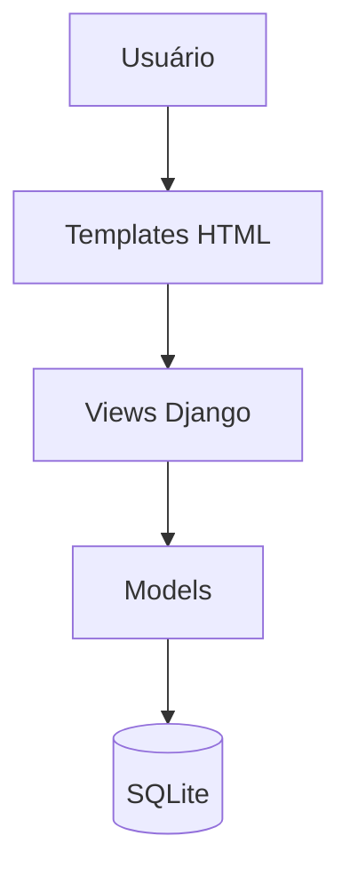

# Arquitetura

---

## Padrão

Monólito Django (MVC/MVT).

→ [[MVC|MVC]]

---

## Backend

Django é responsável pela lógica de negócio, rotas e painel administrativo.

→ [[Django|Django]] · [[Python|Python]] · [[Models|Models]] · [[Views|Views]]

---

## Frontend

Templates HTML renderizados pelo próprio Django, estilizados com Bootstrap. Sem framework JS.

→ [[HTML|HTML]] · [[CSS|CSS]]

---

## Banco de dados

SQLite no ambiente atual, com plano de migrar para PostgreSQL.

→ [[Banco de Dados|Banco de Dados]] · [[Banco de Dados|PostgreSQL]]

---

## Organização de pastas

- portal/
- templates/
- static/

## Veja também

- [[Sobre]]
- [[Fluxo da Aplicação]]
- [[Roadmap]]
