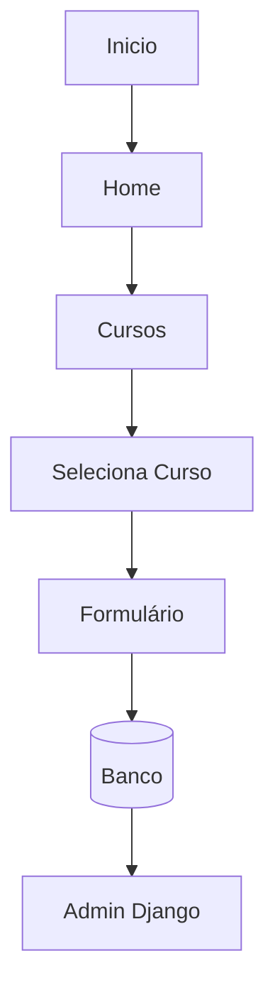

# Fluxo da Aplicação

---

## Passo a passo

1. Usuário acessa o portal
2. Visualiza cursos
3. Escolhe um curso
4. Preenche formulário
5. Sistema salva interesse
6. Administração acompanha pelo painel

## Veja também

- [[Arquitetura]]
- [[Sobre]]
