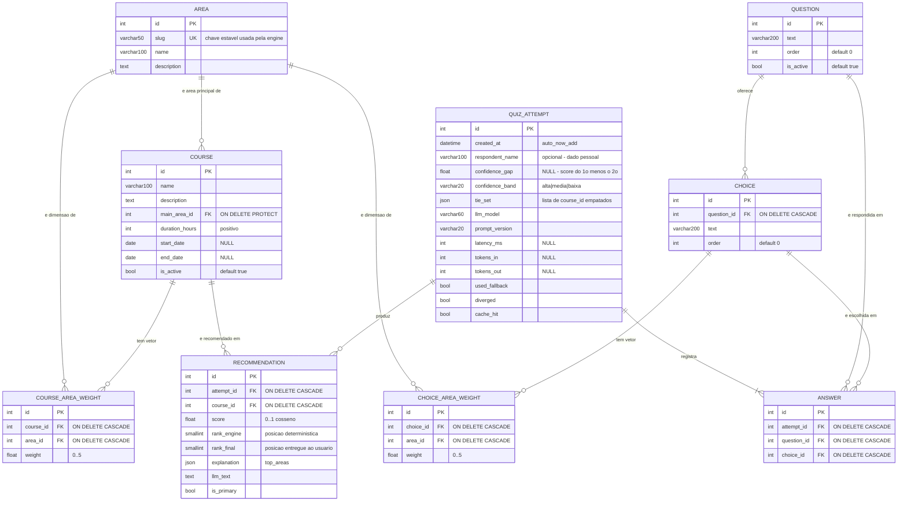

> [!info] Projeto: [[TCC|🎓 TCC]] · Base: [[modelagem-dados-quiz|🗃️ Modelagem de dados]] · Conceitos: [[dad-modelagem-relacional|Modelagem relacional]] · [[dad-normalizacao|Normalização]] · [[dad-indices|Índices]] · [[Banco de Dados|Banco de Dados]]

# 📐 Escopo do DER

> [!abstract] Ideia central
> [[modelagem-dados-quiz|🗃️ Modelagem de dados]] explica **por que** cada model existe. Este documento define **o que o diagrama precisa provar**: perímetro, cardinalidades, restrições e — o ponto que separa um DER de faculdade de um DER de engenharia — **quais regras estão no banco e quais estão só no código**.

**Fonte no repositório:** `tcc-train/docs/der-escopo.md` (versionado, Mermaid renderiza direto no GitHub).

## 1️⃣ Perímetro

| ✅ Dentro | ❌ Fora | Motivo da exclusão |
|---|---|---|
| 9 tabelas de negócio (`catalog` + `quiz`) | `auth_user`, `django_session`, `django_admin_log`, `django_migrations` | Infraestrutura do framework — no máximo um bloco cinza "Django Auth" |
| PK, FK, chaves candidatas e uniques | Matrícula, turma, financeiro | O sistema **recomenda**, não matricula |
| Cardinalidade **e** opcionalidade de todo relacionamento | Particionamento, replicação, tuning físico | Banco é um arquivo SQLite |
| Tipos, NOT NULL, defaults e domínios | Star schema / DW | Anexo opcional (seção 8), não o DER principal |
| Entidades associativas **com atributo** | Prompts e cadeias internas da LLM | Só a **telemetria persistida** é modelada |
| Esquema interno dos campos JSON | | |
| Telemetria de IA da migração `0002_camada_ia` | | |
| Regras garantidas **só na aplicação**, marcadas como tal | | |

## 2️⃣ Três blocos, não um amontoado

```
┌─ catalog ──────────────┐  ┌─ quiz (instrumento) ─────────┐  ┌─ quiz (execução + IA) ────────┐
│ Area                   │  │ Question                     │  │ QuizAttempt                   │
│ Course                 │  │ Choice                       │  │ Answer                        │
│ CourseAreaWeight       │  │ ChoiceAreaWeight             │  │ Recommendation                │
└────────────────────────┘  └──────────────────────────────┘  └───────────────────────────────┘
        catálogo real              instrumento de medida            evidência da execução
     (existe sem o quiz)          (muda quando a régua muda)      (imutável após gravado)
```

> [!important] `Area` é a entidade-ponte
> É o **único vocabulário compartilhado** entre catálogo e instrumento — toda a [[engine-matching-cosseno|🧮 engine]] opera sobre vetores indexados por `Area.slug`. No desenho, `Area` fica na fronteira entre os dois primeiros blocos. Quem coloca `Area` no meio do bloco `catalog` esconde justamente o que faz o sistema funcionar.

## 3️⃣ DER lógico

![[der-completo.svg]]

> [!tip] Como ler (notação de Chen)
> **Retângulo** = entidade (vira tabela) · **losango** = relacionamento (o verbo) · **1 — n** = cardinalidade · **0..1** = participação opcional · `*` chave primária · `°` chave estrangeira · **borda dupla** = entidade associativa (chave composta) · **borda tracejada** = entidade prevista, ainda não implementada.
> Arquivos: `docs/der-completo.svg` (vetorial, para a monografia) e `docs/der-completo.png`.

### Versão em Mermaid (renderiza direto no GitHub)



**Esquema dos campos JSON** — precisa constar como nota no diagrama:

```jsonc
// quiz_recommendation.explanation — no máximo 3 itens (TOP_AREAS)
{ "top_areas": [ { "area": "eletrica", "area_name": "Elétrica",
                   "contribuicao": 45.0, "percentual": 71.4 } ] }

// quiz_quizattempt.tie_set
[ 3, 7, 11 ]   // course_id dentro de epsilon do topo
```

## 4️⃣ Cardinalidades — leitura formal

| Relacionamento | Card. | Opcionalidade | Justificativa |
|---|---|---|---|
| Area → Course (`main_area`) | 1:N | Curso **precisa** de área; área pode não ter curso | `PROTECT` impede apagar área em uso |
| Course ↔ Area (via `CourseAreaWeight`) | N:N | Curso pode ter 0 pesos (score 0) | Vetor **esparso**: só as áreas relevantes são gravadas |
| Choice ↔ Area (via `ChoiceAreaWeight`) | N:N | Alternativa pode ter 0 pesos | Idem |
| Question → Choice | 1:N | ≥ 1 na prática (4 no seed) | Sem constraint de mínimo no banco |
| QuizAttempt → Answer | 1:N | **≥ 1** obrigatório (`allow_empty=False`) | Tentativa sem resposta não gera perfil |
| QuizAttempt → Recommendation | 1:N | 0..`RECOMMENDATION_LIMIT` (=5) | Limite é **configuração**, não constraint |

> [!warning] As duas tabelas de peso não são tabelas de ligação
> `CourseAreaWeight` e `ChoiceAreaWeight` carregam o `weight` — **o dado mais importante do sistema**. No DER aparecem como entidades de pleno direito, nunca como um losango vazio de N:N.

## 5️⃣ Matriz regra × constraint

| ID | Regra | Garantida por | Onde |
|---|---|---|---|
| RN-01 | Um curso não tem dois pesos para a mesma área | `UNIQUE(course, area)` | ✅ banco |
| RN-02 | Uma resposta por pergunta em cada tentativa | `UNIQUE(attempt, question)` | ✅ banco |
| RN-03 | A alternativa respondida pertence à pergunta respondida | `AnswerInputSerializer` | ⚠️ só aplicação |
| RN-04 | Peso no intervalo [0, 5] | Validators do Django | ⚠️ só aplicação |
| RN-05 | Score do cosseno em [0, 1] | Propriedade matemática | ⚠️ não verificada |
| RN-06 | Exatamente uma recomendação com `is_primary` por tentativa | `engine.recommend()` | ⚠️ só aplicação |
| RN-07 | `rank_final` é permutação de 1..N na tentativa | engine / camada LLM | ⚠️ só aplicação |
| RN-08 | Só curso `is_active` entra no ranking | Query da engine | ✅ por design |
| RN-09 | Recalcular apaga as recomendações anteriores | `attempt.recommendations.all().delete()` | ✅ idempotente |

> [!tip] O detalhe que impressiona a banca
> Marcar visualmente (borda tracejada, legenda) as regras ⚠️. Explicitar a diferença entre **integridade declarativa** (banco) e **procedural** (código) é o que separa um DER descritivo de um DER de engenharia — e dá uma resposta pronta para "e se alguém inserir direto no banco?". Ver [[defesa-monografia-tcc|🎤 Defesa]].

## 6️⃣ Índices

Já existem por padrão do Django: PK de tudo, índice em cada FK, `area.slug` único e os quatro `unique_together`.

**Propostos** — baixo custo, ganho nas consultas reais ([[dad-indices|Índices]], [[dad-otimizacao-consultas|Otimização de consultas]]):

| Índice | Consulta beneficiada |
|---|---|
| `catalog_course (is_active, id)` | Filtro da engine a cada recomendação |
| `quiz_recommendation (attempt_id, rank_final)` | Montagem da página de resultado |
| `quiz_quizattempt (created_at DESC)` | Admin e relatórios da monografia |

**Volumetria:** com 1.000 tentativas → ~1.000 attempts, 6.000 answers, 5.000 recommendations e ~100 linhas de referência. **SQLite atende com folga** o horizonte do TCC.

## 7️⃣ Lacunas — o backlog do modelo

Priorizado por impacto na **validade do trabalho**, não por esforço.

> [!danger] P1 — Reprodutibilidade histórica (crítico)
> Os vetores **A** (perfil) e **B** (curso) **não são persistidos**: o `explanation` guarda só as 3 áreas do topo. Recalibrar um peso no `/admin` torna as recomendações antigas **irreproduzíveis** — o score gravado não pode mais ser recalculado a partir dos dados atuais.
> A nota de [[modelagem-dados-quiz|modelagem]] diz que persistir a recomendação dá reprodutibilidade; isso vale para **o que a pessoa viu**, não para **como o número foi obtido**. São coisas diferentes, e a banca pode perguntar pela segunda.
> **Correção mínima, sem tabela nova:** `QuizAttempt.profile_vector` (JSON) e `Recommendation.course_vector` (JSON).
> **Fazer antes** de começar os testes com pessoas reais — depois disso, o histórico já nasceu não-auditável.

> [!warning] P2 — Telemetria de IA misturada com o fato de negócio
> `QuizAttempt` acumula 10 colunas de LLM. No [[decisao-camada-ia|Desenho B modificado]] haverá **retries e re-execuções**, e uma linha única não comporta o histórico.
> **Proposta:** extrair `LLMRun` (1:N a partir de `QuizAttempt`) com `model`, `prompt_version`, `latency_ms`, `tokens_in/out`, `used_fallback`, `diverged`, `cache_hit`, `created_at`.
> Ganho colateral: o **custo de API por tentativa** vira mensurável — número que o [[camada-ia-plano-implementacao|🧩 plano]] precisa. Fazer **antes** de escrever o código da LLM.

> [!note] P3 — Promover regras de aplicação a constraints
> - `CHECK (weight BETWEEN 0 AND 5)` nas duas tabelas de peso · `CHECK (score BETWEEN 0 AND 1)`
> - `UNIQUE(attempt_id, rank_final)` · `UNIQUE(attempt_id) WHERE is_primary` (constraint parcial)
> - `CHECK (end_date IS NULL OR end_date >= start_date)` em `Course`
> - RN-03 não tem solução declarativa simples: ou fica na aplicação **com teste dedicado**, ou `Answer.question_id` some e passa a ser lido de `choice.question_id` — elimina a redundância na origem
> - Trocar `unique_together` por `UniqueConstraint` (o primeiro está em depreciação no Django) — cuidado com a armadilha já registrada em [[bugs-e-licoes-tcc|🐛 bugs]]: fora do `Meta`, o Django ignora em silêncio

> [!note] P4 — Coerência semântica e LGPD
> - `Course.main_area` é redundante com `CourseAreaWeight` e nada obriga que seja a área de maior peso. **Regra a declarar** no DER, senão os dois campos contam histórias diferentes.
> - `respondent_name` é **dado pessoal**. Definir finalidade, prazo de retenção e anonimização — a [[spec-autenticacao-lista-interesse|🔐 spec de autenticação]] ratificou que o quiz continua anônimo, o que ajuda, mas o campo de texto livre continua lá.

## 8️⃣ Escopo previsto — fase 2 (`accounts`)

A [[spec-autenticacao-lista-interesse|🔐 spec de autenticação e lista de interesse]] já congela três mudanças estruturais. O DER precisa nascer preparado para elas, marcadas como **previstas**, não como existentes:

| Entidade / campo | Relacionamento | Observação |
|---|---|---|
| `accounts.User` (login por e-mail) | — | Substitui `auth_user`; referenciar sempre `AUTH_USER_MODEL` |
| `QuizAttempt.user` | User 1:N QuizAttempt, `SET_NULL` | Tentativa continua **anônima** por padrão; o vínculo é o *claim* pós-login |
| `accounts.InterestItem` | User 1:N · Course `PROTECT` · QuizAttempt `SET_NULL` | Carrega `score_snapshot`, `rank_snapshot`, `was_primary` |

> [!success] Os snapshots do `InterestItem` são o P1 aplicado
> A spec chegou sozinha à mesma conclusão desta nota: congelar o número no momento do evento. É a **métrica de resultado do experimento engine × LLM** — e ela só existe se o dado for congelado. Vale unificar o critério: se `InterestItem` congela, `Recommendation` também deveria.

## 9️⃣ Anexo opcional — camada analítica

Só se o grupo quiser um capítulo de análise de resultados **com números**. Modelo estrela derivado do OLTP, sem tocar no transacional:

- **Fato** `fato_recomendacao` — grão: (tentativa, curso recomendado); métricas `score`, `rank_engine`, `rank_final`, `delta_rank`, `is_primary`
- **Dimensões**: `dim_curso`, `dim_area`, `dim_tempo`, `dim_perfil` (banda de confiança + área dominante)
- **Responde:** quais cursos **nunca** aparecem em 1º lugar (peso mal calibrado); distribuição de `confidence_band`; com que frequência a LLM diverge da engine

## 🔟 Entregáveis e critérios de aceite

| # | Entregável | Formato |
|---|---|---|
| D1 | DER conceitual (só entidades e relacionamentos) | 1 página — vai na apresentação |
| D2 | DER lógico completo | Mermaid versionado + PNG |
| D3 | Dicionário de dados | Seções 3 e 4 |
| D4 | Matriz regra × constraint | Seção 5 |
| D5 | Backlog do modelo | Seção 7 |

> [!check] Aceite
> 1. Toda tabela de negócio aparece **exatamente uma vez**
> 2. Todo relacionamento tem cardinalidade **e** opcionalidade legíveis nos dois sentidos
> 3. Toda FK indica a ação de exclusão (CASCADE / PROTECT / SET_NULL)
> 4. Campos JSON têm o esquema documentado em nota
> 5. Regras só-da-aplicação estão visualmente diferenciadas
> 6. O diagrama vem de fonte versionada, não de um binário solto
> 7. O modelo continua verdadeiro após `migrate` numa base limpa — conferir com `manage.py sqlmigrate`

## ⚠️ Riscos

| Risco | Impacto | Mitigação |
|---|---|---|
| Recalibrar pesos invalida o histórico | **Alto** — compromete a análise de resultados | P1 antes dos testes com pessoas reais |
| Camada de IA sem telemetria separada | Médio — perde rastreabilidade de retries e custo | P2 antes do código da LLM |
| DER desenhado à mão divergir do banco | Médio — a banca compara e encontra | D2 versionado + `sqlmigrate` |
| `respondent_name` sem política de retenção | Médio — questionamento de LGPD na defesa | P4 |

## Veja também

- [[TCC|🎓 TCC]]
- [[modelagem-dados-quiz|🗃️ Modelagem de dados]] — o **porquê** de cada model
- [[engine-matching-cosseno|🧮 Engine de matching]] — quem consome os vetores
- [[camada-ia-plano-implementacao|🧩 Plano da camada de IA]]
- [[spec-autenticacao-lista-interesse|🔐 Spec de autenticação e lista de interesse]]
- [[dad-modelagem-relacional|Modelagem relacional]] · [[dad-normalizacao|Normalização]] · [[dad-indices|Índices]]
